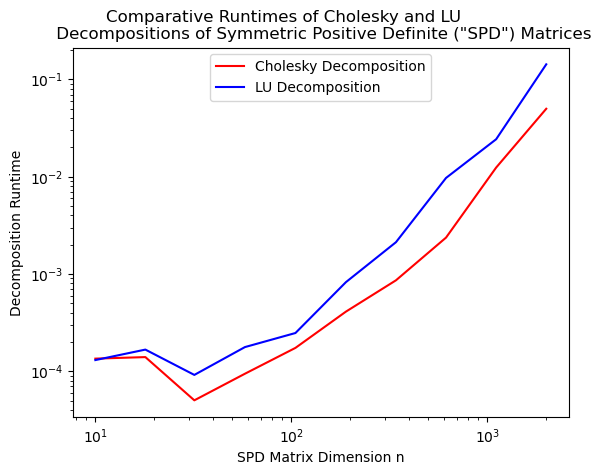
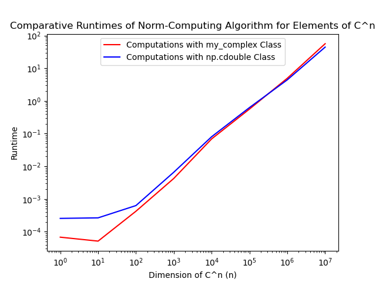

# Answers

Put any answers to questions in the assignment in this file, or any commentary you don't include in the code.

This is a markdown file (the `.md` extension gives it away). If you have never used markdown before, check out [this short guide](https://guides.github.com/features/mastering-markdown/).

## Problem 0

Part (A)
The plots below depict the empirical eigenvalue distributions of our 100 n x n symmetric matrices with random N(0,1) entries for n = 200, 400, 800, 1000, and 1600. In each case, the eigenvalues appear to be distributed according to the Wigner semicircle distribution with radius R = 2n (see, e.g., http://math.uchicago.edu/~may/REU2021/REUPapers/Jiang,Tianchong.pdf). As such, for each one-row and one-column increase in the dimensions of our matrices, the radius of the distribution (which dictates its variance) increases by 2. The errors between the histogram and the postulated Wigner distribution are depicted in red in each graph and are generally close to zero (but increase toward the edges of each plot to due to the increasing steepness of the Wigner distribution further from its center).

/hist_evals_200x200.png)
/hist_evals_400x400.png)
/hist_evals_800x800.png)
/hist_evals_1000x1000.png)
/hist_evals_1600x1600.png)

Part (B)
The plot below depicts the empirical distribution of the largest eigenvalues of 1000 200x200 matrices with random N(0,1) entries. These maximum eigenvalues appear to follow a normal distribution, as shown below.

/hist_max_evals.png)

Part (C)
The plot below depicts the empirical distribution of the largest gaps between consecutive eigenvalues of 1000 200x200 matrices with random N(0,1) entries. These maximum gaps appear to follow a beta distribution.

/hist_eval_gaps.png)

Part (D)
The plots below depict the empirical distributions of singular values of our 100 symmetric n x n matrices with random N(0,1) entries for n = 200, 400, 800, and 1600. In each case, the singular values appear to be distributed according to a PDF with a quarter-circle shape.

/hist_singular_vals_200x200.png)
/hist_singular_vals_400x400.png)
/hist_singular_vals_800x800.png)
/hist_singular_vals_1600x1600.png)

Part (E)
The plots below depict the empirical distributions of condition numbers of our 100 symmetric n x n matrices with random N(0,1) entries for n = 200, 400, 800, and 1600.

/hist_condition_nums_200.png)
/hist_condition_nums_400.png)
/hist_condition_nums_800.png)
/hist_condition_nums_1600.png)

## Problem 1

Part (B):

As shown in the chart above, in practice, the Cholesky decomposition is marginally faster than the LU decomposition (even though both factorizations are O(n^3)).

Part (C):
First, we note that the Fibonacci number-generating matrix is 2x2. In each call of our matrix_pow(A, n) function on an m x m matrix A, we (1) compute the eigendecomposition of A using eigh, (2) multiply each of m eigenvectors by itself n times, and (3) multiply three matrices together. The first of these steps can be computed in O(m^3) = O(2^3) = O(1) time. The second of these steps involves 2n operations, so can be computed in O(2n) = O(n) time. And the third of these steps can be computed in O(m^3) = O(2^3) = O(1) time (see, e.g., https://medium.com/@kilichbekhaydarov/toward-an-optimal-matrix-multiplication-algorithm-4f024baa1206). Thus, the asymptotic speed of our matrix_pow(A, n) function is O(1 + n + 1) = O(n).

Meanwhile, we found in Homework 0 that our Egyptian multiplication-inspired algorithm for computing A^n was O(log2(n)). Thus, our eigenvector decomposition-based approach to computing matrix powers should be asymptotically slower than our previous Egyptian multiplication-inspired algorithm.

Since the Fibonacci numbers are integers, powers of the Fibonacci number-generating matrix F := [[1, 1], [1, 0]] should naturally have entries that are also integers. However, for sufficiently large exponents n, our function matrix_pow(F, n) will have entries with nonzero fractional components due to floating point precision errors.

## Problem 2

Part (B)

For large values of n, the cdouble class is more efficient than our my_complex class at computing the norms of elements of C^n. It is therefore optimal to store vectors of complex numbers by leveraging numpy's existing cdouble and ndarray classes.

## Feedback
