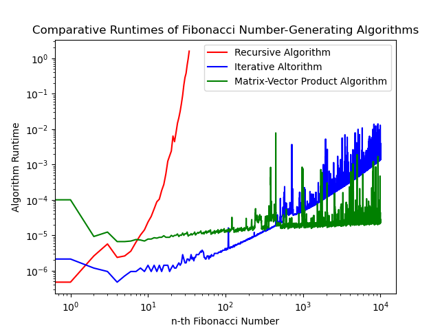

# Answers

Put any answers to questions in the assignment in this file, or any commentary you don't include in the code.

This is a markdown file (the `.md` extension gives it away). If you have never used markdown before, check out [this short guide](https://guides.github.com/features/mastering-markdown/).

## Problem 0
You don't need to say anything here.  Just complete [`fizzbuzz.py`](fizzbuzz.py).

## Problem 1
For any given n >= 0, egyptian_multiplication(a, n) makes ceiling(log2(n)) recursive calls. However, the last of these calls always has the form egyptian_multiplication(a, 1) and simply returns a: there are no additions associated with this call. Therefore, the number of recursive calls that involve at least one addition is floor(log2(n)).

Within any given call to egyptian_multiplication(a, n), one addition is performed if n is even, and two additions are performed if n is odd (and greater than 1). In other words, if n is odd (and greater than 1), one extra addition is performed compared to when n is even. In a sequence of recursive calls of egyptian_multiplication(a, n), n will be odd #(n*) times, where n* is the initial value of n. Thus, egyptian_recursion(a, n*) will perform exactly #(n*) - 1 "extra" additions attributable to odd intermediate values of n. We subtract 1 to account for the fact that in the final recursive call egyptian_multiplication(a, 1), no additions are performed.

Thus, the total number of additions done in the Egyptian multiplication algorithm egyptian_multiplication(a, n) is floor(log2(n)) + #(n) - 1.

## Problem 2

To determine the n-th Fibonacci number, our recursive function is called 2^(n-1) + 1 times: 2^(n-1) recursive calls, plus the initial call. During each call, a single addition is performed. Thus, to determine the n-th Fibonacci number, our recursive algorithm performs 2^(n-1) + 1 operations. Thus, our recursive function is O(2^(n-1) + 1) = O(2^(n-1)) = O(2^n).

On the other hand, our iterative function requires only n-1 iterations to determine the n-th Fibonacci number. During each iteration, a single addition is performed. Thus, to determine the n-th Fibonacci number, our iterative algorithm performs n-1 operations. Thus, our iterative function is O(n-1) = O(n).

Since 2^n > n for all n >= 0, our iterative function is asymptotically faster than our recursive function.

(Note: In the above discussion, "^" is used to denote exponentiation rather than "**" to avoid activating markdown's boldface.)

## Problem 3

Generalizing our analysis of the Egyptian multiplication algorithm under Problem 1 above to our Egyptian-inspired matrix power algorithm, we note that to raise the Fibonacci number-generating matrix A to the (n-1)th power requires floor(log2(n)) + #(n) - 1 additions. To determine x_n comprised of the n-th and (n-1)th Fibonacci numbers, our algorithm performs an additional six operations (four additions and 2 multiplications) through matrix-vector multiplication. Thus, in total, our matrix-vector product algorithm determines the n-th Fibonacci number in floor(log2(n)) + #(n) + 5 operations. As such, our matrix-vector product algorithm is O(floor(log2(n)) + #(n) + 5) = O(log2(n)).

Since log2(n) <= n <= 2^n for all n >= 0, our matrix-vector product algorithm is asymptotically faster than both our recursive and iterative algorithms.

Fibonacci numbers get very large very quickly. As such, any of our algorithms are eventually unable to compute some Fibonacci number (along with all subsequent Fibonacci numbers), as it requires too many (e.g.,, >64) bits of storage. However, this limitation can be postponed by storing array values with type np.float64 rather than np.int64. Even though both data types reserve 64 bits for each value, np.float64 allows many of these bits to be interpreted as powers of ten (i.e., as in scientific notation), allowing for the computation and storage of values several orders of magnitude larger than would be allowed by np.int64.

## Problem 4

As expected, we observe that for sufficiently large values of n (i.e., asymptotically), our matrix-vector product algorithm is faster than our iterative algorithm, which in turn is (much) faster than our recursive algorithm.

The fact that our iterative algorithm is faster than our matrix-vector product algorithm for sufficiently small values of n is also not surprising: for a sufficiently large constant c, log2(n) + c will exceed n temporarily, until eventually n exceeds log2(n) + c for all n thereafter.

## Feedback
